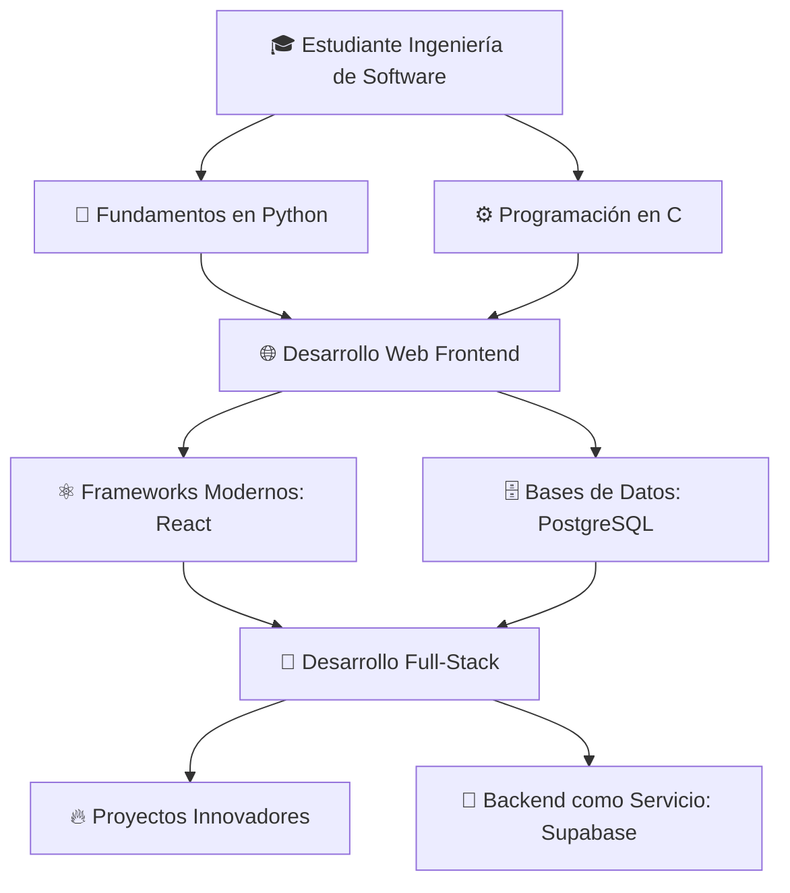

# 👋 ¡Hola! Soy Omar Villalpando

## 🚀 Desarrollador Full Stack en Formación

Soy un estudiante apasionado de **Ingeniería de Software** en **Hybridge Education**, mexicano, con un fuerte interés en el desarrollo web y de software. Mi objetivo es crear soluciones tecnológicas innovadoras que resuelvan problemas reales.

---

## 🛠️ Stack Tecnológico

### 💻 **Lenguajes de Programación**

### 🌐 **Frontend & Desarrollo Web**

### 🗄️ **Bases de Datos & Backend**

---

## 📊 Estadísticas de GitHub

  

---

## 📚 Proyectos Destacados

### 🔥 **Proyectos Actuales**
- 🎓 **Proyectos Académicos** - Desarrollo de software como parte de mi formación en Hybridge Education
- 🌐 **Aplicaciones Web Full-Stack** - Combinando React, Python y PostgreSQL
- 🚀 **Proyectos Personales** - Explorando nuevas tecnologías y mejores prácticas

### 💡 **Áreas de Interés**
- **Arquitectura de Software** - Diseño de sistemas escalables
- **APIs RESTful** - Desarrollo de backend robusto
- **UI/UX Design** - Creación de interfaces intuitivas
- **Bases de Datos** - Optimización y diseño de esquemas
- **Metodologías Ágiles** - Scrum y desarrollo iterativo

---

## 📈 Mi Journey en Desarrollo

## 🌟 Sobre Mí

🇲🇽 Mexicano · 🎓 Estudiante · 💻 Desarrollador · 🚀 Innovador

- 🎯 Enfoque: Calidad del código y mejores prácticas
- 📚 Aprendizaje Continuo: Siempre explorando nuevas tecnologías
- 🤝 Colaborativo: Me encanta trabajar en equipo y compartir conocimiento
- 💡 Solucionador de Problemas: Enfocado en crear soluciones efectivas
- 🌱 En Crecimiento: Constantemente mejorando mis habilidades técnicas

## 📫 ¡Conectemos!

https://img.shields.io/badge/LinkedIn-Connect%2520with%2520me-0077B5?style=for-the-badge&logo=linkedin&logoColor=white
https://img.shields.io/badge/GitHub-Follow%2520my%2520work-181717?style=for-the-badge&logo=github&logoColor=white
https://img.shields.io/badge/Portfolio-Visit%2520my%2520portfolio-FF7139?style=for-the-badge&logo=firefox&logoColor=white

## 💬 Frase Inspiradora
> "El software es una gran combinación entre arte e ingeniería" - Bill Gates

⚡ ¿Tienes un proyecto interesante?
🚀 ¡Hablemos y colaboremos juntos!
https://komarev.com/ghpvc/?username=omarvillalpando&color=blueviolet&style=flat-square

Última actualización: Diciembre 2023

